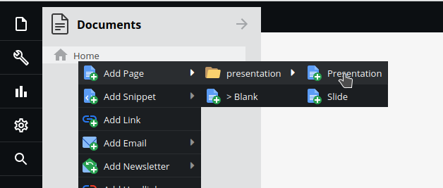
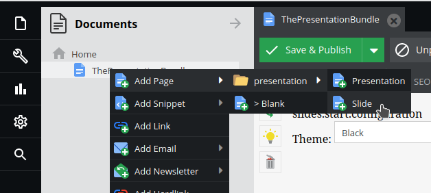

# Pimcore Presentation Bundle

The bundle provides two additional Document Types to ease the creation of new presentations:

1. Presentation \
   The presentation itself, a container for your slides
2. Slide \
   A slide contains your custom content 
 
## Create a Presentation

1. Create a new document of type "Presentation" anywhere in your document tree \

2. Create a child document of your presentation using the type "Slide" \

3. Add content to your slide using one of the provided areablocks or create your own areablocks
4. Create more Slides

Slides in a presentation can be navigated horizontaly. Each slide can have child slides which enable a vertical navigation (https://revealjs.com/vertical-slides/).

Once saved and published you can view and navigate your presentation. 
